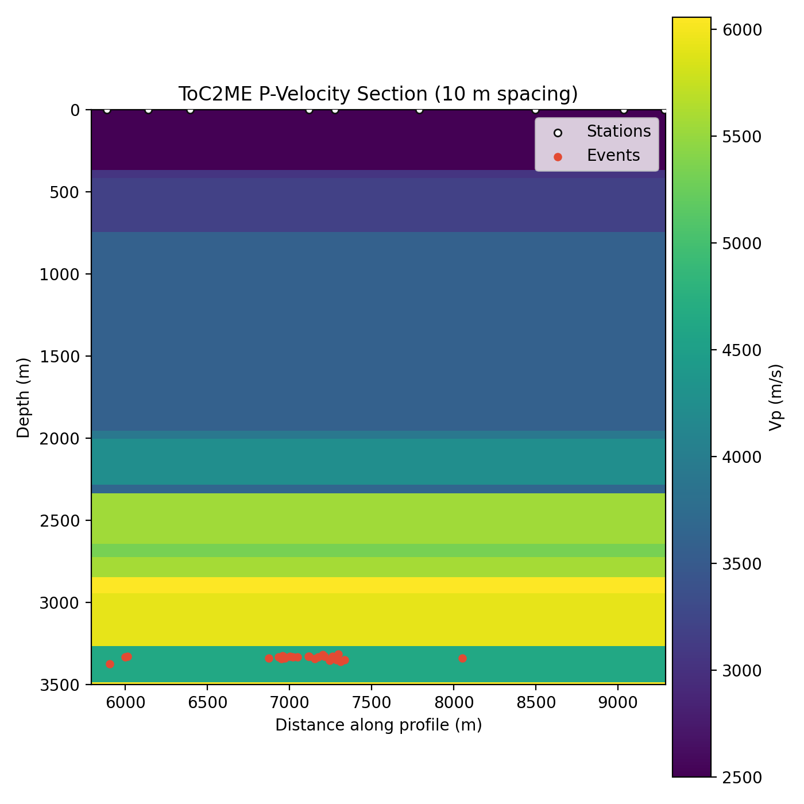
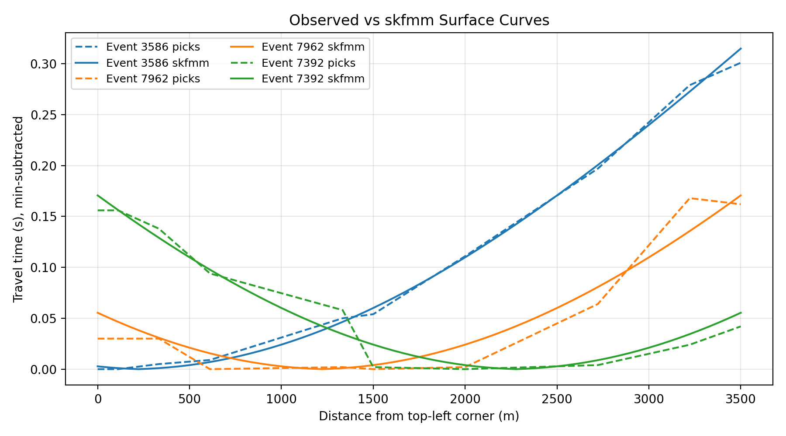
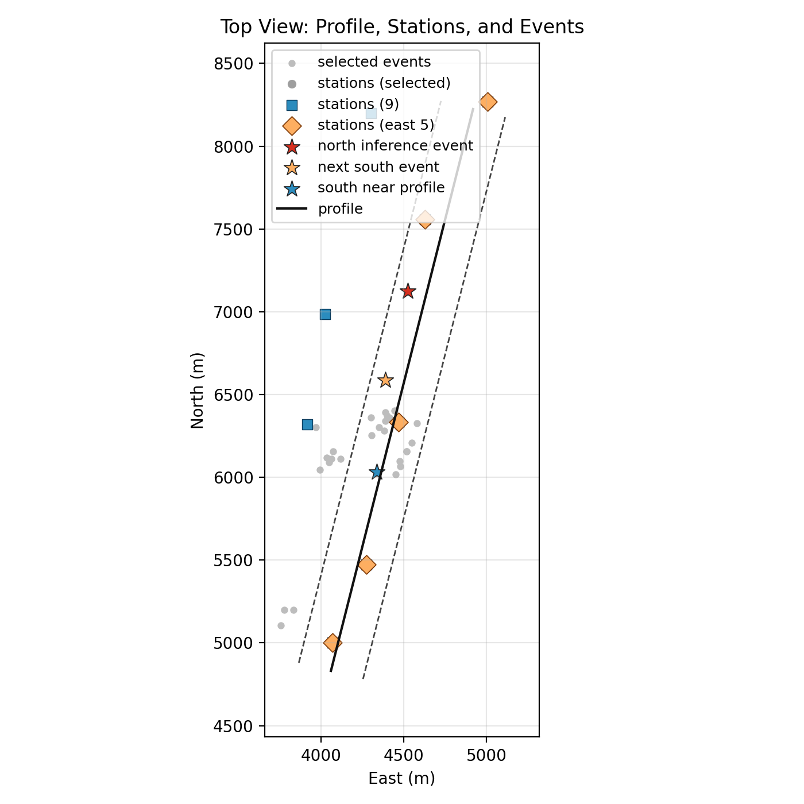

<body>

  
  
  
  

<h2> Repository Utilities (Data Prep and Inference Inputs) </h2>

  <b>Short description:</b> End-to-end utilities to extract 2D profiles, build travel-time curves,
  compare observations to skfmm, and prepare inference tensors for microseismic workflows.

  This repository now includes a lightweight processing toolkit to build 2D profile inputs,
  traveltime curves, and inference tensors. All scripts default to the <b>outputs/</b> folder
  and can be redirected with <b>--out-dir</b> to keep variants side-by-side.

  <b>Keywords:</b> microseismic, travel-time, fast marching, skfmm, ToC2ME, 2D profile, inversion, FWI

<h3> Scripts </h3>
<ul>
  <li><b>scripts/toc2me_profile.py</b>: select a dense 2D profile corridor, filter events/stations, and export picks.</li>
  <li><b>scripts/toc2me_velocity_section.py</b>: plot the 2D velocity section (full and zoomed).</li>
  <li><b>scripts/toc2me_64grid_picks.py</b>: build a 64x64 grid, choose 3 events, and interpolate traveltimes (supports east-5 station subset).</li>
  <li><b>scripts/toc2me_compare_curves.py</b>: compare observed picks vs skfmm curves; optional residual-spline correction and CSV export.</li>
  <li><b>scripts/toc2me_ddpm_prep.py</b>: build DDPM stacks (physical + normalized).</li>
  <li><b>scripts/toc2me_inference_prep.py</b>: build inference tensors and torch samples (named outputs supported).</li>
  <li><b>scripts/toc2me_top_view.py</b>: top-view map with stations/events, profile line, and east-5 profile selection.</li>
</ul>

<h3> Data Assets </h3>
<ul>
  <li><b>data/ToC2MEVelModel.mat</b>: 1D velocity model (z, vp). Used by velocity-section and grid prep scripts.</li>
</ul>

<h3> Outputs (examples) </h3>
<ul>
  <li><b>outputs/profile_map.png</b>, <b>outputs/profile_summary.json</b>, <b>outputs/selected_*.csv</b></li>
  <li><b>outputs/velocity_section_2d.png</b>, <b>outputs/velocity_section_2d_zoomed.png</b></li>
  <li><b>outputs/velocity_model_64x64.npy</b>, <b>outputs/event_locations_64.csv</b></li>
  <li><b>outputs/traveltime_curves_64.csv</b>, <b>outputs/compare_traveltime_curves.png</b>, optional residual/skfmm CSVs</li>
  <li><b>outputs/stack_*.npy</b>, <b>outputs/inference_*.npy</b>, <b>outputs/inference_sample*.pt</b></li>
  <li><b>outputs/profile_top_view*.png</b> (including east-5 variants)</li>
</ul>

  Note: <b>skfmm</b> is required for curve comparison and synthetic TT generation. If you encounter
  libstdc++ issues, preload the system library (e.g., <b>LD_PRELOAD=/lib/x86_64-linux-gnu/libstdc++.so.6</b>).

<h3> Quick Start </h3>
<pre>
python -m pip install -r requirements.txt
python scripts/toc2me_profile.py --plot
python scripts/toc2me_64grid_picks.py
python scripts/toc2me_inference_prep.py --vel-norm train-noclip
</pre>

  Optional curve comparison (requires skfmm):

<pre>
LD_PRELOAD=/lib/x86_64-linux-gnu/libstdc++.so.6 python scripts/toc2me_compare_curves.py --residual-spline pchip
</pre>

<h3> Usage Examples </h3>
<pre>
# Export skfmm curves and build a named inference sample
LD_PRELOAD=/lib/x86_64-linux-gnu/libstdc++.so.6 python scripts/toc2me_compare_curves.py \
  --residual-spline none \
  --out-curves outputs/traveltime_curves_64_skfmm.csv \
  --out-curves-source skfmm

python scripts/toc2me_inference_prep.py \
  --vel-norm train-noclip \
  --curves outputs/traveltime_curves_64_skfmm.csv \
  --out-dir outputs/skfmm \
  --out-sample outputs/inference_sample_skfmm.pt

# Build east-5 station curves and inference sample
python scripts/toc2me_64grid_picks.py \
  --station-subset east5 \
  --station-ids outputs/selected_event_picks_9stations.csv \
  --out-dir outputs/east5

python scripts/toc2me_inference_prep.py \
  --vel-norm train-noclip \
  --curves outputs/east5/traveltime_curves_64.csv \
  --out-dir outputs/east5 \
  --out-sample outputs/inference_sample_east5.pt
</pre>

<h3> Expected Outputs (with screenshots) </h3>
<figure>
  

  <figcaption>Velocity section (zoomed).</figcaption>
</figure>

<figure>
  

  <figcaption>Observed vs skfmm curves (with optional residual spline).</figcaption>
</figure>

<figure>
  

  <figcaption>Top view with east-5 profile selection and highlighted events.</figcaption>
</figure>

<h3> Results Summary (Example) </h3>
<ul>
  <li>Extracts a consistent 2D profile corridor with station/event filtering.</li>
  <li>Generates 64-point travel-time curves and skfmm comparisons with residual-spline correction.</li>
  <li>Prepares inference-ready tensors and torch samples with consistent normalization.</li>
</ul>

<h3> FAQ (Minimal) </h3>
<ul>
  <li><b>skfmm import fails with libstdc++?</b> Use LD_PRELOAD with your system libstdc++.</li>
  <li><b>Where are outputs written?</b> By default to <b>outputs/</b>; override via <b>--out-dir</b>.</li>
  <li><b>No inference_sample.pt generated?</b> Install <b>torch</b> (optional dependency).</li>
</ul>

<h3> How to Cite </h3>
<ul>
  <li>ToC2ME field program: <a href="https://pubs.geoscienceworld.org/ssa/srl/article/543218/induced-seismicity-characterization-during">Eaton et al., 2018 (SRL)</a>.</li>
  <li>Velocity model: <a href="https://doi.org/10.5281/zenodo.4574248">Zenodo 4574248</a>.</li>
  <li>See <b>CITATION.cff</b> for copy-paste citation metadata.</li>
</ul>
    
<h2> The ToC2ME Field Program </h2>

 The Tony Creek Dual Microseismic Experiment (ToC2ME) field program was a research-led project by the University of Calgary, in collaboration with a number of industry partners, investigating hydraulic fracturing within the Kaybob-Duvernay horizon in the Fox Creek area, Alberta. The ToC2ME acquisition system consisted of 69 cemented shallow boreholes, each with one three-component geophone at 27 m, and three one-component geophones at 22 m, 17 m and 12 m respectively (all OYO Geospace Seismic Recorder (GSX)-3 sensors with a sampling rate of 0.002 seconds). Furthermore, 6 broadband seismometers (Nanometrics Trillium Compact 20s) and 1 strong-motion accelerometer were co-located to allow enhanced analysis of the recorded seismicity. These sensors continuously monitored a four-well hydraulic fracture experiment for ~40 days in late 2016. 

 The ToC2ME data set is the focus of ongoing investigation by researchers at the University of Calgary and the University of Alberta. 

<figure>
  

  <figcaption> Geophone Setup, Figure taken from <a href="https://pubs.geoscienceworld.org/ssa/srl/article/543218/induced-seismicity-characterization-during?casa_token=yArCmgQ71zcAAAAA:UXJD2MdzlhdUL5ne-4YOeuTvqB1ErPE0j6u0QSxSscg8X_ddWxPl50OUESPFCUn3MILZgKs"> Eaton et al., 2018 (SRL)</a>. Blue triangles = geophones; red square = co-located accelerometer; green circles = co-located broadband stations. </figcaption>
</figure>

<h2> Overview of Published Catalogues </h2>

 Previously published catalogues using data from the ToC2ME field program are archived here. Summaries of the research undertaken, the published catalogue, and a link to the published paper can be found within each corresponding folder and README.md file. 

   
<a href="https://pubs.geoscienceworld.org/ssa/srl/article/543218/induced-seismicity-characterization-during?casa_token=yh-OBTD_SpcAAAAA:XQRSqBDz927xBR4HeIaOlpTzCyM4sOfrWpQPRttwfT1J8duyvNi27dKB-Y1HPJ39FPP4Q4c"> <b> Eaton:</b> </a> >25,000 putative event detections using 15 templates (high signal-to-noise) in match-filtering analysis, of which ~14,000 events detected using a stacked amplitude envelope method. Hypocenter locations determined for 4083 high quality events from a global search methodology, and subsequently relocated using cross correlations. Moment magnitudes determined using S-wave displacement spectrum (4083 events).
    
<b> Igonin:</b> 18,040 events located from original match-filter catalogue of <a href="https://pubs.geoscienceworld.org/ssa/srl/article/543218/induced-seismicity-characterization-during?casa_token=yArCmgQ71zcAAAAA:UXJD2MdzlhdUL5ne-4YOeuTvqB1ErPE0j6u0QSxSscg8X_ddWxPl50OUESPFCUn3MILZgKs"> Eaton et al., 2018 (SRL) </a> using a beamforming methodology by stacking waveforms along ray-tracing travel times within a volume. Moment magnitudes determined using S-wave displacement spectrum.

<a href="https://library.seg.org/doi/full/10.1190/geo2019-0046.1"> <b> Poulin:</b> </a> 12,663 events located from original stacked-amplitude catalogue of <a href="https://pubs.geoscienceworld.org/ssa/srl/article/543218/induced-seismicity-characterization-during?casa_token=yArCmgQ71zcAAAAA:UXJD2MdzlhdUL5ne-4YOeuTvqB1ErPE0j6u0QSxSscg8X_ddWxPl50OUESPFCUn3MILZgKs"> Eaton et al., 2018 (SRL) </a> using P- and S-wave time picks being correlated to P-P and P-S reflections to provide VP and VS time-depth control. 

 <a href="https://doi.org/10.1785/0120200082"> <b> Rodriguez-Pradilla:</b> </a> 10,691 events detected using 17 templates (high signal-to-noise) in match filtering analysis and automatic phase picking determined by an STA/LTA algorithm. Events located in X and Y using the normal move-out equation; depths obtained by finding the depth that minimizes the root-mean-square (RMS) of the travel time residuals.

<h2> Data Download from IRIS </h2>

 Continuous seismic data from the ToC2ME field program was released through IRIS on 1 July 2020, and can be requested using the BREQ_FAST tool <a href="https://ds.iris.edu/ds/nodes/dmc/forms/breqfast-request/"> here</a>. Users will need the following information to download the full dataset: 

<ul>
  <li>Network Code: 5B </li>
  <li>Stations begin with: 1* (to avoid conflict with data from the NCEDC network which was also operational in the Fall of 2016) </li>
  <li>Data Start: 2016-10-25 </li>
  <li>Data End: 2016-12-01 </li>
  <li>Broadband Stations: 1109, 1112, 1141, 1147, 1166, 1178. Location code: -- </li>
  <li>Accelerometer: 1158. Location code: -- </li>
</ul>

 Please be aware that the network code 5B has been used for a number of other temporary seismic deployments over the years with data housed at IRIS. In order to download the ToC2ME data, the correct dates in 2016 need to be inserted. The full station list and associated metadata can be found <a href="https://ds.iris.edu/mda/5B/?starttime=2016-01-01T00:00:00&endtime=2017-12-31T23:59:59"> here</a>. 

<h2> *** Known Issues *** </h2>

<ul>
    <li> The instrument response information for the <b>geophones</b> available through IRIS is <b><i>incorrect</i></b> - We are working as quickly as possible to resolve the issue and get the correct response information to IRIS. If you have already downloaded any part of the ToC2ME dataset from IRIS, please send an email to <a href="mailto:toc2me@ucalgary.ca">toc2me@ucalgary.ca</a> so that we can provide you with the correct information as soon as we have it. 
</ul>

<h2> References </h2>

 We ask that any publications arising from this dataset reference <a href="https://pubs.geoscienceworld.org/ssa/srl/article/543218/induced-seismicity-characterization-during?casa_token=yArCmgQ71zcAAAAA:UXJD2MdzlhdUL5ne-4YOeuTvqB1ErPE0j6u0QSxSscg8X_ddWxPl50OUESPFCUn3MILZgKs"> Eaton et al., 2018 (SRL)</a>: 

<blockquote> Eaton, D.W., Igonin, N., Poulin, A., Weir, R., Zhang, H., Pellegrino, S. and Rodriguez, G., 2018. Induced seismicity characterization during hydraulic‐fracture monitoring with a shallow‐wellbore geophone array and broadband sensors. <i> Seismological Research Letters</i>, 89(5), pp.1641-1651. </blockquote>

 If you take advantage of the published catalogues listed here, see the folder README.md file for details of the additional references you will need. 

<h2> Contact </h2>

 Questions regarding the catalogue, the download of data and/or previous work utilizing the ToC2ME datasets can be directed to <a href="mailto:toc2me@ucalgary.ca">toc2me@ucalgary.ca</a>. 

 Github site maintained by the University of Calgary. 

<h2> Acknowledgements </h2>

 The ToC2ME program was enabled by generous support from two anonymous companies. Continuous geophone data were collected by Terra-Sine Resources and recorded under license from Microseismic Inc. for use of the BuriedArray method. We thank IRIS for their continued efforts for data management, which fosters collaboration such as this one. 

</body>
